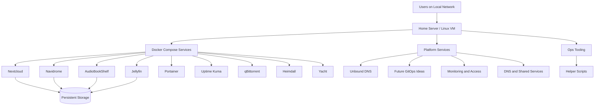

# Home Server DevOps Lab

A portfolio-grade self-hosted infrastructure project that I use to design, operate, and evolve real services in a home lab environment.

This repository captures how I organize service deployments, platform configuration, and day-to-day operational tooling. It reflects the kind of engineering work I do as a DevOps engineer: containerized workloads, service isolation, persistent storage, DNS, and maintainable infrastructure layout.

## Why This Project Matters

This is not a toy setup or a single `docker-compose.yml` experiment. It is a long-running home lab used to practice and demonstrate:

- infrastructure ownership beyond day-job tasks
- service-oriented repository design
- Docker Compose based workload management
- architecture thinking for future GitOps-style workflows
- operational thinking around persistence, networking, and maintainability
- documentation discipline for public-facing technical work

For me, this repo is both:

- a practical operating environment for self-hosted services
- a public DevOps portfolio project that shows how I structure and manage infrastructure

## Highlights

- Clean service-per-folder structure under [`services/`](/Users/iansh/Desktop/Devops-experience/homeserver/homeserver_public/services)
- Shared platform concerns separated into [`platform/`](/Users/iansh/Desktop/Devops-experience/homeserver/homeserver_public/platform)
- Operational scripts isolated in [`ops/scripts/`](/Users/iansh/Desktop/Devops-experience/homeserver/homeserver_public/ops/scripts)
- Docker Compose-first service organization with room for future platform evolution
- Public-safe repository with sensitive values and internal-only details removed or generalized
- Architecture and workload documentation under [`docs/architecture.md`](/Users/iansh/Desktop/Devops-experience/homeserver/homeserver_public/docs/architecture.md) and [`docs/services.md`](/Users/iansh/Desktop/Devops-experience/homeserver/homeserver_public/docs/services.md)

## Architecture Overview

At a high level, this lab is built around multiple nodes with clear role separation for firewalling, infrastructure services, application workloads, and DNS. Application workloads are organized individually, while platform-level building blocks are kept separate from service-specific configs.



For the fuller node-by-node architecture and traffic model, see [`docs/architecture.md`](/Users/iansh/Desktop/Devops-experience/homeserver/homeserver_public/docs/architecture.md).

## Tech Stack

- Docker
- Docker Compose
- Linux / Ubuntu Server
- Proxmox
- Unbound DNS
- Twingate
- Tailscale
- Prometheus
- Grafana

## Repository Structure

```text
homeserver_public/
├── services/
│   ├── audibookshelf/
│   ├── heimdall/
│   ├── jellyfin/
│   ├── navidrome/
│   ├── nextcloud/
│   ├── portainer/
│   ├── qbittorrent/
│   ├── uptime-kuma/
│   ├── yacht/
│   └── kustomization.yaml
├── platform/
│   ├── dns/
│   │   └── unbound/
│   └── flux/
│       └── my-cluster/
│           └── flux-system/
└── ops/
    └── scripts/
```

### Structure Philosophy

- `services/` holds application-owned assets so each service is easy to find, review, and evolve
- `platform/` contains shared infrastructure concerns that support multiple services
- `ops/` contains small operational helpers that do not belong to any single app

This separation makes the repository easier to navigate and gives it a more production-like shape.

## Services Included

| Service | Purpose | Deployment Assets |
| --- | --- | --- |
| AudioBookShelf | Audiobooks and podcast hosting | Compose, with some experimental platform-related files in the repo |
| Heimdall | Service dashboard / landing page | Compose |
| Jellyfin | Media server | Compose |
| Navidrome | Music streaming | Compose |
| Nextcloud | Personal cloud storage and collaboration | Compose |
| Portainer | Docker management UI | Compose |
| qBittorrent | Download client | Compose |
| Uptime Kuma | Service monitoring and uptime checks | Compose |
| Yacht | Lightweight container management UI | Compose |

For workload placement across the homelab, see [`docs/services.md`](/Users/iansh/Desktop/Devops-experience/homeserver/homeserver_public/docs/services.md).

## Platform Components

### DNS

[`platform/dns/unbound/`](/Users/iansh/Desktop/Devops-experience/homeserver/homeserver_public/platform/dns/unbound) contains the Unbound deployment and configuration. This represents an important part of the lab because it shows that the setup is not limited to app containers alone; it also includes supporting infrastructure components.

### Platform Experiments

[`platform/flux/my-cluster/flux-system/`](/Users/iansh/Desktop/Devops-experience/homeserver/homeserver_public/platform/flux/my-cluster/flux-system) contains exploratory GitOps-related files that were part of earlier thinking, not the current primary operating model for the lab.

## DevOps Practices Demonstrated

- Modular service ownership through per-service directories
- Clear separation of application, platform, and operational concerns
- Infrastructure-as-code style repository organization
- Persistent volume handling for stateful services
- Self-hosted DNS and service networking awareness
- iterative platform thinking beyond basic Compose-only setups
- Public documentation hygiene by removing or generalizing sensitive information

## What I Learned Building And Maintaining This

- How quickly home lab repos become hard to maintain without clear structure
- Why service ownership and directory conventions matter for long-term readability
- How stateful self-hosted services differ from stateless demo deployments
- The operational tradeoffs between “quick to launch” and “easy to maintain”
- how to keep a homelab ready for future platform evolution without overengineering it too early
- How documentation quality affects project credibility just as much as the configs themselves

## Why This Is On My GitHub

This repository is part of my public engineering profile. I maintain it to show evidence of:

- hands-on DevOps experience beyond professional work alone
- long-term infrastructure ownership
- curiosity and experimentation with real systems
- the ability to organize technical work in a readable and maintainable way

I also write technical articles that connect to this kind of work on Medium:
https://teckdebate.medium.com

## Suggested Screenshots To Add

To make this project even stronger as a portfolio piece, the next useful additions would be:

- Portainer dashboard screenshot
- Uptime Kuma status page screenshot
- Jellyfin or Nextcloud service UI screenshot
- one network or architecture diagram exported as PNG/SVG

If added later, place them under a `docs/images/` folder and reference them from this README.

## Security And Privacy

This is a sanitized public repository. Sensitive values, secrets, hostnames, and internal network details have been removed, replaced, or generalized.

## Future Improvements

- Add CI checks for YAML and manifest quality
- Add architecture images under `docs/images/`
- Add per-service documentation for setup decisions and storage mapping
- Expand observability with metrics and centralized logging
- Add deployment notes and operational runbooks

## Disclaimer

This is a personal infrastructure lab built for learning, experimentation, and continuous improvement. It intentionally reflects real-world DevOps themes while keeping private details out of the public repo.
